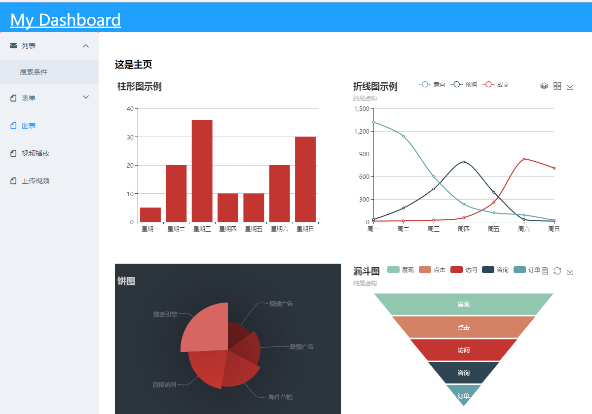
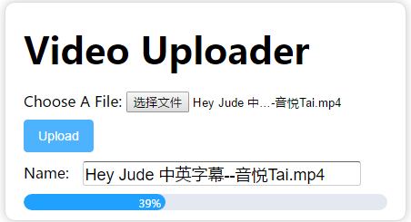

# dashboard

> vue2 vuex vue-route study demo

Images
------




## Build Setup

``` bash
# install dependencies
mkdir server/{upload,temp}

npm install -g pm2
(linux: sudo npm install -g pm2)

npm install

# serve with hot reload at localhost:8080
npm start ( or pm2 start apps.json )  

# build for production with minification
npm run build

# build for production and view the bundle analyzer report
npm run build --report
```

### 文件目录
+ server
  - upload —— 上传的视频存放目录,请确保默认播放demo.mp4存在
  - temp —— 上传的视频临时目录

+ src
  - api —— API请求
  - assets —— 图片等资源文件
  - components —— 通用组件
  - mock —— API请求拦截器
  - pages —— 页面文件夹
  - resources —— mock 数据源

感谢：https://github.com/ElemeFE/element-dashboard